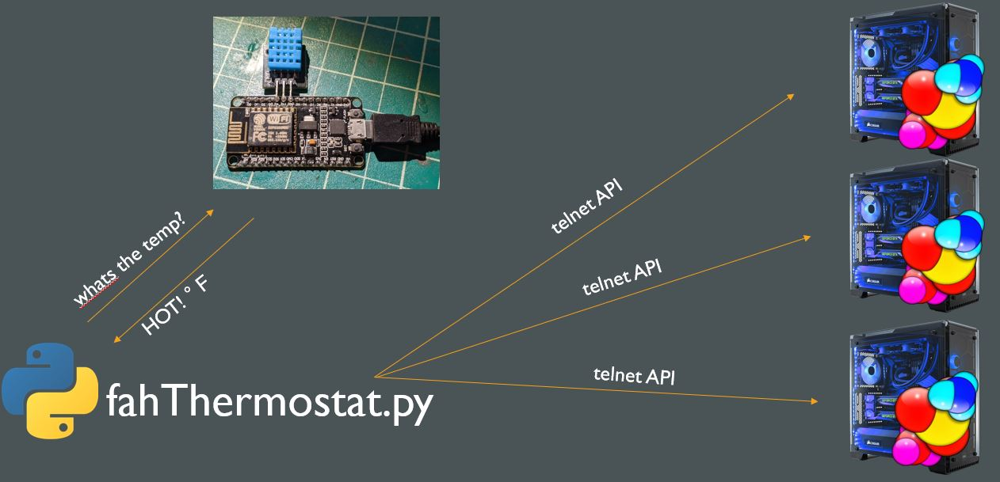

# fahThermostat

A system that uses an ESP8622 to measure temperature and a python script that toggles folding@home clients via telnet api to regulate temperatures of a room.

* main.py is a flask server where the target temp can be controlled and it has a scheduled job that does the main thermostat loop and commands FAH clients.
* graph.py uses pandas and matplotlib to graph the systems results.
* FAH_temp.ino is the firmware for ESP8622 that collects/averages samples and then hosts a webserver so main.py can retrieve temperatures.

Note: each FAH client must be configured to allow telnet access from IP where main.py is running.

some example charts. black line is target temp. squiggly line is actual temp, its red when FAH is running and blue when it is not.

